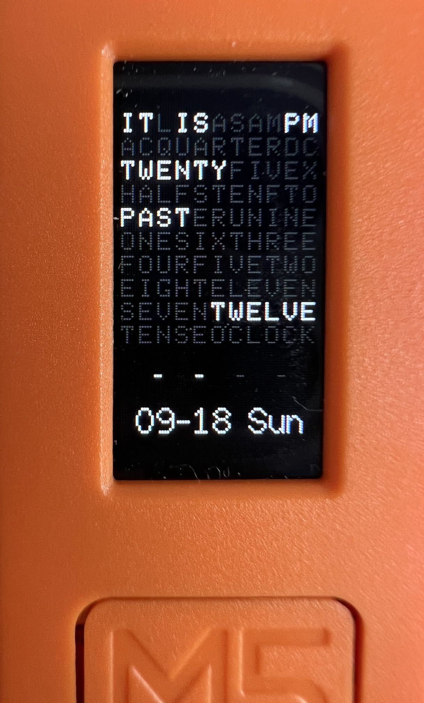

# M5StickC-QlockTwo

This project implement a very simple [QlockTwo Watch](https://qlocktwo.com/ww/qlocktwo-w) on M5StickC.
Use Button A to switch mode (Qlock, Simple and Off), use Button B to sync time via Internet.

References:
[1] https://github.com/LordLeXaT/m5StickC-Clock
[2] https://github.com/techiesms/M5Stick-C-Smart-Watch-

